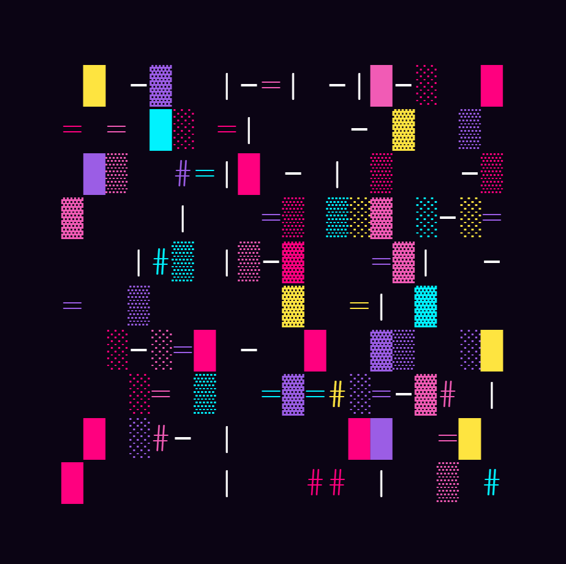
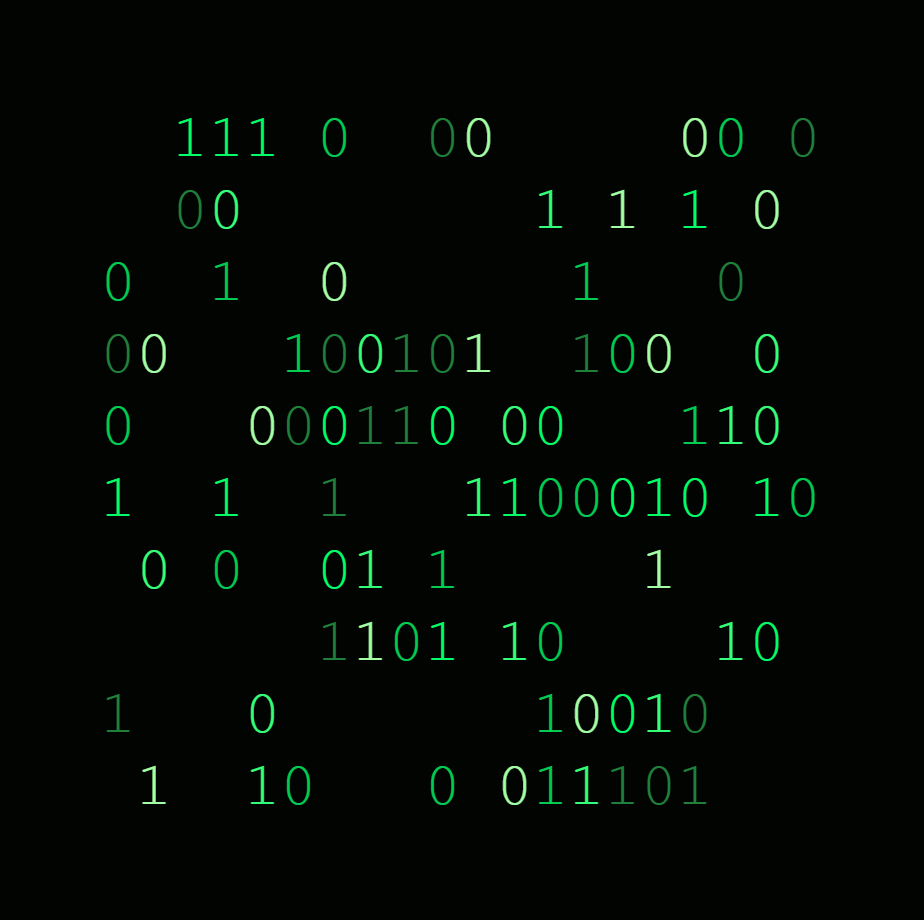
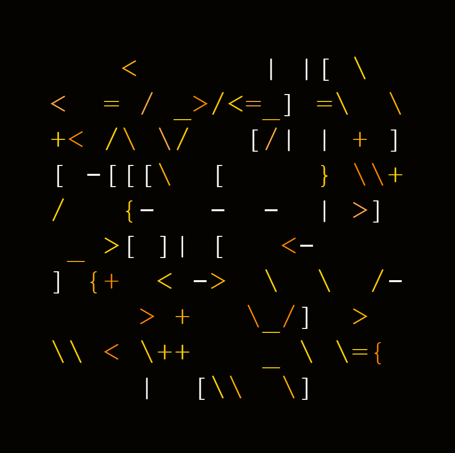

# Abstract ASCII Art Generator


A lightweight Flask web application for generating colorful abstract ASCII artwork. Customize character sets, adjust generation parameters, switch between visual themes, copy the generated output or export it as a PNG image.

## Examples

| Example 1 | Example 2 | Example 3 |
| :-------: | :-------: | :-------: |
|  |  |  |
| .png) | .png) | .png) |

## Features

✅ Generate random abstract ASCII artwork

✅ Multiple visual themes

✅ Custom character sets

✅ Adjustable width, height and spacing

✅ Copy artwork to the clipboard

✅ Export artwork as PNG

✅ Responsive interface

## Installation

Clone the repository:

```bash
git clone https://github.com/TranceMeli/ArtGenerator.git
```

Navigate to the project folder:

```bash
cd ArtGenerator
```

Install the dependency:

```bash
pip install flask
```

Run the application:

```bash
python app.py
```

Open your browser:

```text
http://127.0.0.1:5000
```

## Usage

1. Select a visual theme.
2. Choose a character set or enter your own.
3. Configure the artwork settings.
4. Generate the ASCII artwork.
5. Copy the result or export it as a PNG image.

## Project Structure

```text
ArtGenerator/
├── static/
│   ├── app.js
│   └── style.css
├── templates/
│   └── index.html
├── images/
│   ├── ascii-art_1.png
│   ├── ascii-art_2.png
│   └── ascii-art_3.png
├── app.py
└── README.md
```

## License

Licensed under the MIT License.
